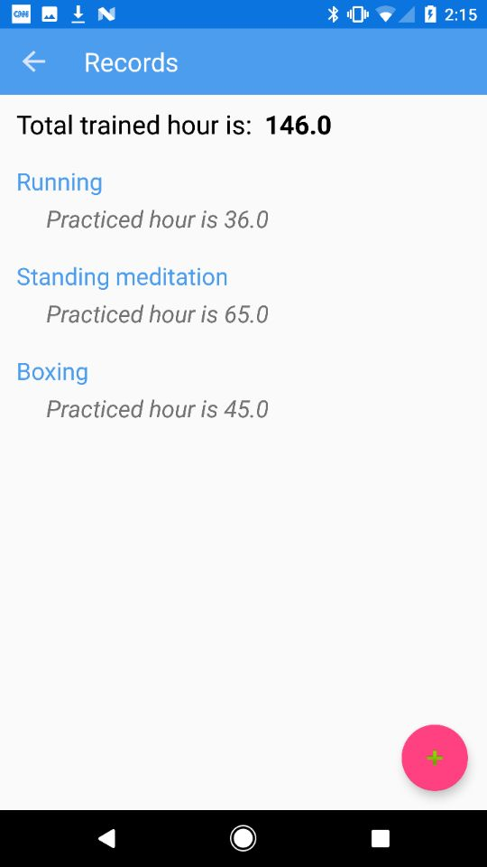
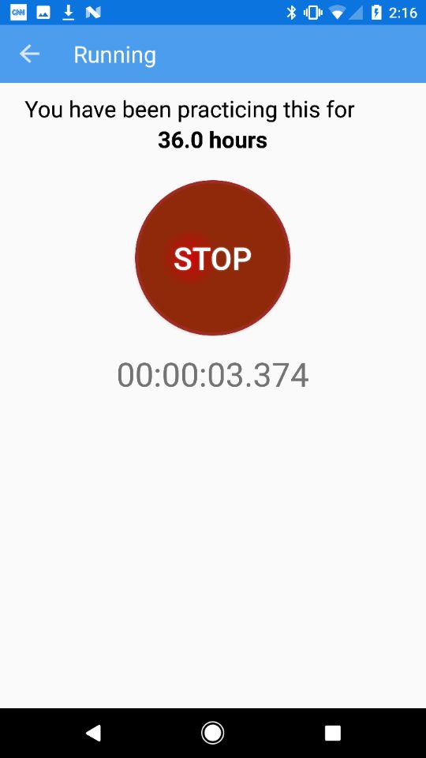
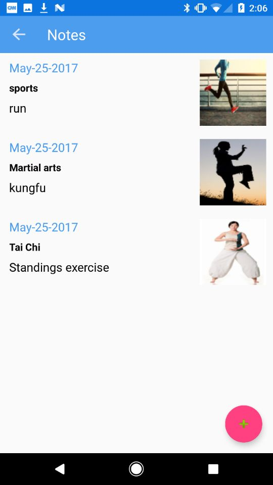
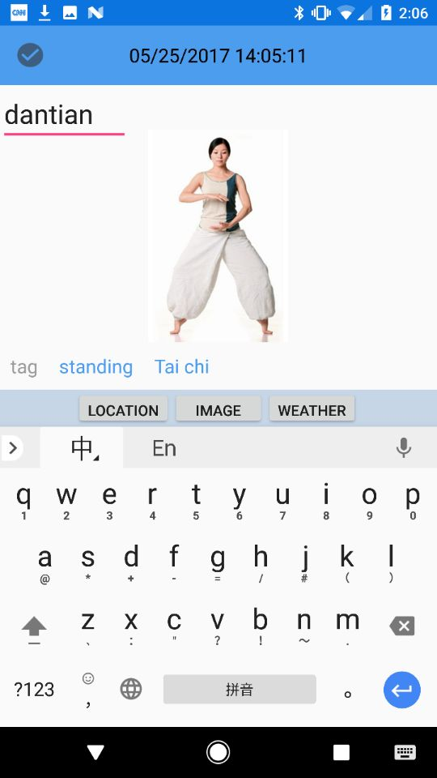
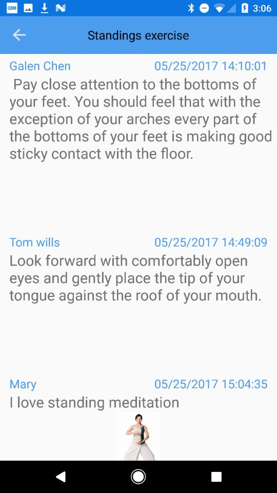
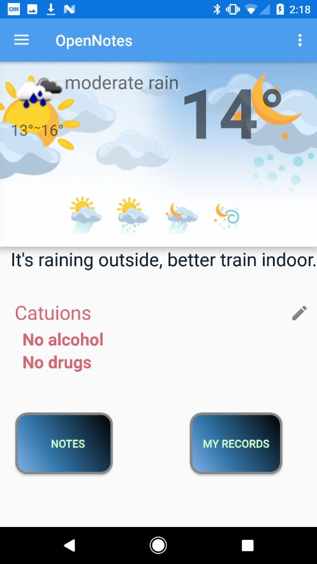

## google play store link
          https://play.google.com/store/apps/details?id=com.galen.opennotes
          
## What the app does & how it's useful
          you can create notes in this app, and write sub_notes in that.
          and you can choose to share it or not.
          if you want to share it, you have to need a sharecode which is tied with the note title.
          only the people have the same title of notes and same share code, they can make their sub_notes public to each other.
          
          in some sports ,such as, kungfu, every movement is very hard to learn and you will have a lot feellings about it.
          And there are some trick or tips can help people do better.
          this app can help people share their thought on that movement.
          
## screenshots
 (myrecords)
 (stopwatch)
 (notes list)
 (notes content)
 (public note contents)
 (main page)   
  
        

     
       
        
         
           
##  technologies, techniques, libraries I used
          Firebase auth: let user create their own account, so that they can store their data in the cloud
          API : get the location and weather
          googleservice: get location
           recyclerview : firebase recyclverview 
          singleton : pass data between activities
          sqlite: store local data
          Retrofit: get the api data 
          Gson: get the api data
          
## general approach
          I make the important layouts first and add all the functions and methods that i going to use.
          then, I start to create those functions or methods.
          then I create class object in order to make things clear.
          then, starting using firebase to write and read data
          Last, I create a stopwatch to help people keep tracking of training.
          
## Bugs
          1:i can not add image when i editing my notes. I can only add image when i add a new note content.
          2:if it is first time sign in, the get location will crush,becasue there is no last location
          3:remove the cuation that is not the last one will crush the app
          4:remove my records may crush the app
          5:not a bug, but you have to click the refresh button after you add a sharecode, in order to see the wall
          6: it take a long time to upload the image to firebase, meanwhile if you click on something, it will crush your app.
         
          
          
          
          
        

                    
